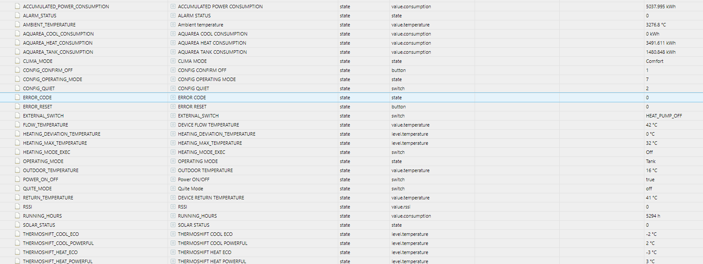
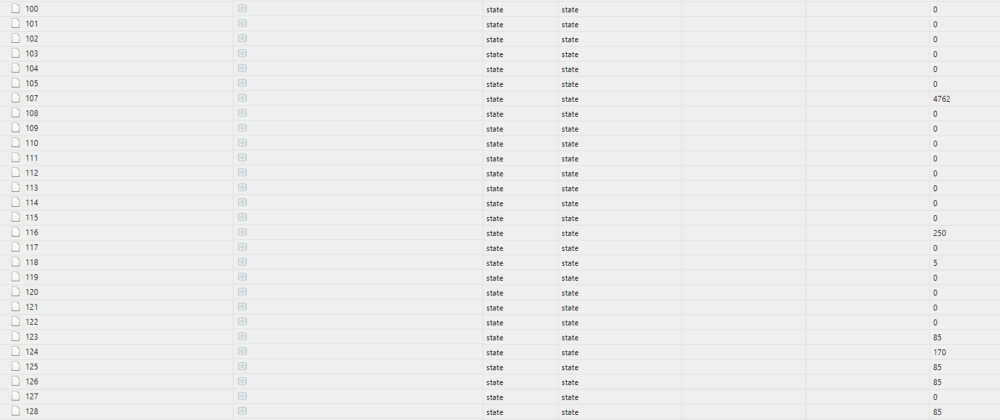
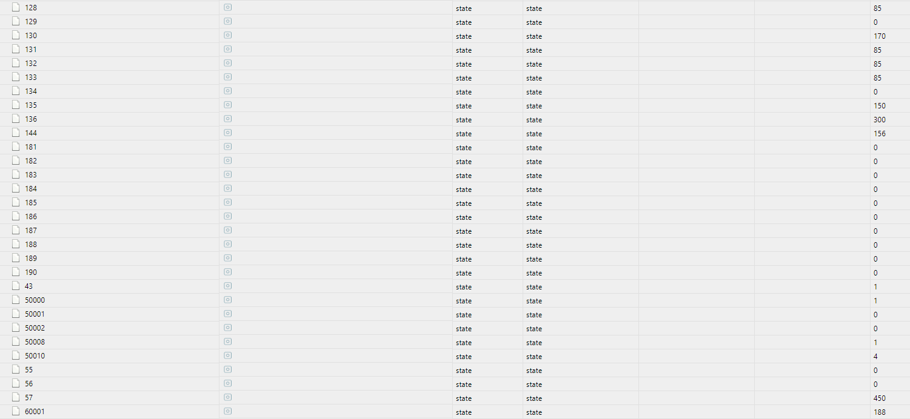
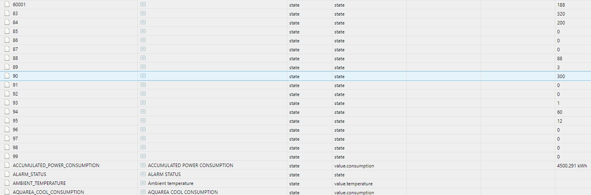
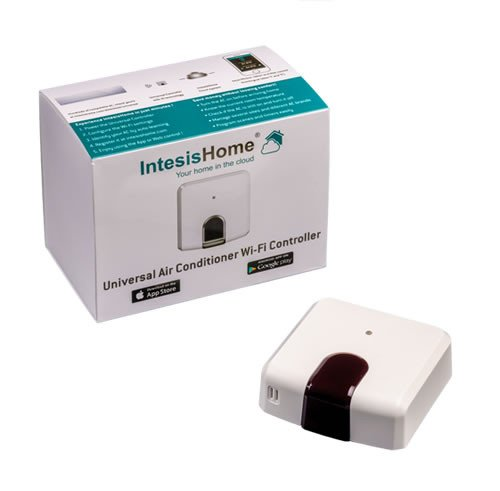
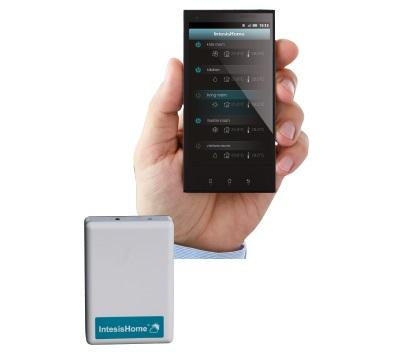
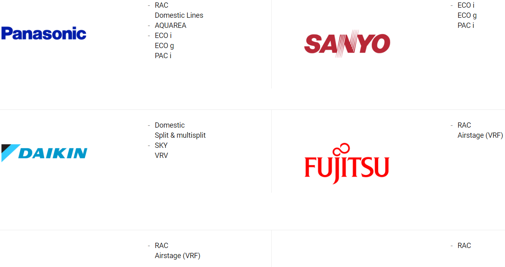
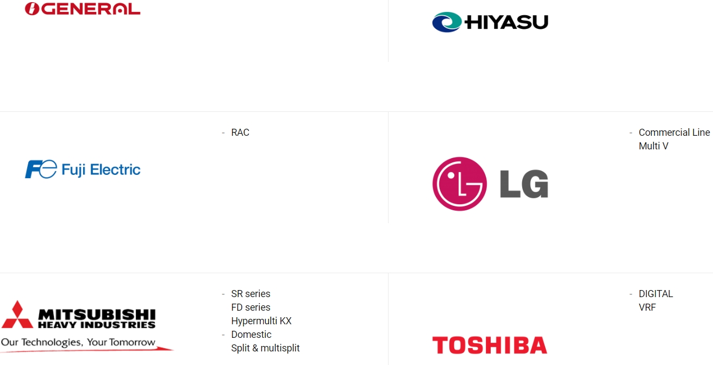

dann können Sie folgende Datenpunkte sehen:

und folgende Punkte müssen/ können noch benannt/definiert werden:

mit diesem Adapter und dieser Hardware:

oder

können Sie Klimaanlagen Air Conditioner oder Wärmepumpen(Heatpump) mit dem ioBroker bedienen und kontrollieren.

Bitte installieren Sie es (über GitHub), testen Sie es und berichten über Ihre Erfolge  :D 

Folgende Hersteller werden unterstützt:

(ich nutze die Aquarea Geisha WH-MDC05F3E5), die Infos dazu hier http://aquarea.smallsolutions.de
geht aber auch mit MXC09G3E8, WH-MXC12D9E8, WH-SDC(SDF)03E3E5 und folgenden

RAC
Domestic Lines
AQUAREA
ECO i
ECO g
PAC i

Domestic
Split & multisplit
SKY
VRV

Airstage (VRF)

Commercial Line
Multi V

SR series
FD series
Hypermulti KX
Domestic
Split & multisplit

DIGITAL
VRF